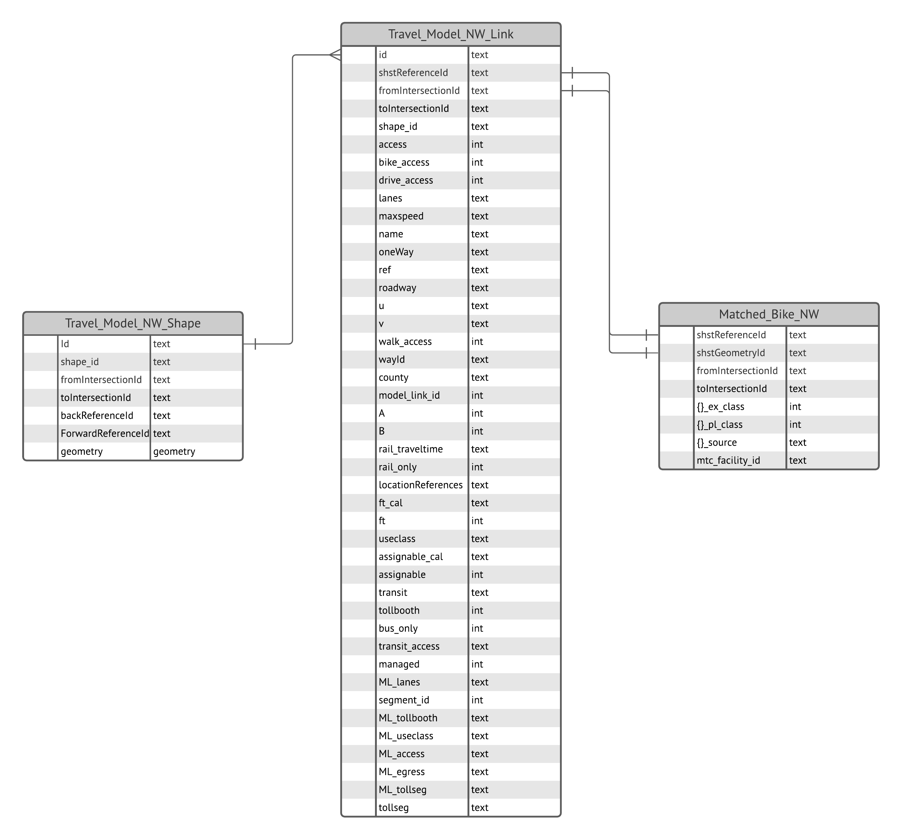

-- Draft --

# Active Transportation Plan Data Development

Create a consolidated, Regional Bike Network dataset conflated to the Travel Model II network, which include all bike facilities collected from the 9-Bay Area Congestion Management Agencies (CMAs) and the 3 largest Bay Area Cities - San Jose, San Francisco, and Oakland. 

## Project Resources

Add links to:
- [Asana Task](https://app.asana.com/0/229355710745434/1199875072414782)
- [Box Data Development & Outputs Directory](https://mtcdrive.box.com/s/gy0u7jg4i1mwad9vqarzlkigg6qxbcvv)
- [Box Data Collection Directory](https://mtcdrive.app.box.com/folder/140341300081?s=tnttek9iqztxw1ibaj7ltyot2e66yikd)
- [Bike Ped Network Data Collection Inventory](https://mtcdrive.box.com/s/tfuj96k1tqqirg42c8qtlzty7gd8pi2u)

### Table of Contents

- [Data Sources](#data-sources)
- [Analysis Parameters](#analysis-parameters)
    - [Regional Bikeway Network Classes](#expected-regional-bikeway-network-schema)
- [Methodology](#methodology)
- [Results](#results)
    - [Bike Network Conflation Match Results](#bike-network-conflation-match-results)
    - [Conflated Bike Network Datasets](#conflated-bike-network-datasets)
        - [Conflated Bike Network Schema](#conflated-bike-network-schema)
        - [Travel Model Network Link Schema](#travel-model-network-link-schema)
        - [Travel Model Network Shape Schema](#travel-model-network-shape-schema    )
    - [Active Transportation ERD](#active-transportation-erd)
- [Related Work](#related-work)

## Data Sources

- [Regional Bikeway Network (MTC Access Only)](https://arcgis.ad.mtc.ca.gov/portal/home/item.html?id=3a58a12a474444e3ab60b5551fba1a9a)
- [Regional Bikeway Network (Public)](https://opendata.mtc.ca.gov/datasets/regional-bikeway-network-2019/explore)
- [State, County, City Bike and Pedestrian Networks](https://mtcdrive.app.box.com/folder/140341300081?s=tnttek9iqztxw1ibaj7ltyot2e66yikd)

### Source Organizations
| Source                                               | Type                  | Website                                                                           |
|------------------------------------------------------|-----------------------|-----------------------------------------------------------------------------------|
| City of Oakland Department of Transportation       | City                  | https://www.oaklandca.gov/departments/transportation                              |
| Alameda County Transportation Authority              | CMA                   | https://www.alamedactc.org/                                                       |
| City/County Association of Governments San Mateo   | CMA                   | https://ccag.ca.gov/                                                              |
| Contra Costa Transportation Authority                | CMA                   | https://ccta.net/                                                                 |
| Napa Valley Transportation Authority                 | CMA                   | https://www.nvta.ca.gov/                                                          |
| San Francisco County Transportation Authority      | CMA                   | https://www.sfcta.org/                                                            |
| Solano Transportation Authority                      | CMA                   | https://sta.ca.gov/                                                               |
| Sonoma County Transportation Authority               | CMA                   | https://scta.ca.gov/                                                              |
| Transportation Authority of Marin                    | CMA                   | https://www.tam.ca.gov/                                                           |
| Valley Transportation Authority                      | CMA                   | https://www.vta.org/                                                              |
| Bay Area Trails Collaborative                        | Non-Profit / Advocacy | https://www.railstotrails.org/our-work/trailnation/bay-area-trails-collaborative/ |
| California Department of Transportation District 4 | State                 | https://dot.ca.gov/caltrans-near-me/district-4                                    |

## Analysis Parameters

### Expected Regional Bikeway Network Schema

| Column                     | Column Alias                       | Type    | Description                                                                                                                                                                       | Domain        |
|----------------------------|------------------------------------|---------|-----------------------------------------------------------------------------------------------------------------------------------------------------------------------------------|---------------|
| shstReferenceId            | Shared Street Reference Id         | text    | SharedStreets References (SSR) are directional edges in a road network. Two-way streets have two SSRs, one for each direction of travel, while one-way streets only have one SSR. |               |
| shstGeometryId             | Shared Street Geometry Id          | text    | SharedStreets Geometries are street centerline data derived from the basemap used to produce SharedStreets References. A single geometry is shared by each reference id.          |               |
| fromIntersectionId         | Shared Street From Intersection Id | text    |                                                                                                                                                                                   |               |
| toIntersectionId           | Shared Street To Intersection Id   | text    |                                                                                                                                                                                   |               |
| {data_source_abbrv}_ex_cl  | Existing Class                     | numeric | Existing bicycle facility class value                                                                                                                                             | 0;1;2;3;4;999 |
| {data_source_abbrv}_pl_cl  | Planned Class                      | numeric | Planned or proposed bicycle class value                                                                                                                                           | 0;1;2;3;4;999 |
| {data_source_abbrv}_source | Source                             | text    | Indicates shst matching calculation applied to match a bike facility or its segment to a shst roadway segment                                                                     |               |
| mtc_facility_id            | MTC Facility ID                    | text    | Unique identifier assigned to each bicycle facility by MTC                                                                                                                        |               |

Columns with a {data_source_abbrev} are prefixed with abbreviations of the data source. For example, the city of Oakland would have the following column names:

- `oak_ex_cl`
- `oak_pl_cl`
- `oak_source`

The consolidated, regional bike facilities dataset should include a class column with facilities classified as follows: 

**[Highway Design Manual Bicycle Transportation Design](https://web.archive.org/web/20170501101515id_/http://www.dot.ca.gov/hq/oppd/hdm/pdf/english/chp1000.pdf)**

- Class 0: Unpaved, or dirt bike facility. This classification only used for Contra Costa County.
- Class 1: Off-Street Shared-Use Path - A bikeway physically separated from motorized vehicular traffic by an open space or barrier. Pedestrians, skaters, wheelchair users, joggers, and other non-motorized users typically use shared-use paths.
- Class 2: Bike Lane - Portion of the roadway that has been designated by striping, signing and pavement markings for the preferential or exclusive use of bicycles. Some cities and counties also define wide shoulders as bike lanes. Always ride about 4 feet from parked cars to avoid the door zone.
- Class 3: On-Street Bike Route - Any road or street designated for bicycle travel. These routes are not for the exclusive use of cyclists. Often, routes include residential streets with low auto volumes and speeds.
- Class 4: Separated Bike Lanes - Separated bike lanes, also known as cycle tracks or protected bike lanes, are a dedicated bikeway that combines the user experience
 of a multi-use path but are located on a street. They are physically distinct from the sidewalk and separated from motor vehicle traffic by a physical object such as parking, a curb, or posts.
- Class 999: The classification was unknown or not yet determined.

## Methodology

The consolidated, Regional Bike Facilities dataset was created through a mix of manual updates to the facility geometries using ArcGIS Pro desktop editing tools, as well as a scripted processes in python jupyter notebooks. State, City, and Non-Profit Advocacy Bike Facility datasets also underwent processing to standardize the schema and values to match the expected columns and attribute values as indicated in the [Regional Bikeway Network Schema](#regional-bikeway-network-schema). Each of these datasets were then conflated with the Travel Model II Network, leveraging the [Shared Streets Python Library](https://github.com/sharedstreets/sharedstreets-python). The results of this work are a series of datasets by source, modeled after the [Regional Bikeway Network Schema](#regional-bikeway-network-schema) above.

Processing Steps:

1. Project each bike network dataset to NAD1983 UTM Z 10N, or EPSG 26910
2. Review facilities that cross jurisdictional boundaries, edit line ends to connect to facilities in adjacent jurisdictions
3. Map class attributes from jurisdiction class to a standardized classification using only numeric values. If class stored in a single column, separate class into existing or planned class columns based on a status column if present. Otherwise if an existing and planned / proposed class column already exists, add those values to the existing and planned class columns. ([See Regional Bikeway Network Schema](#regional-bikeway-network-schema))
	- [Bike Network Data Cleanup Notebook](Bike_Network_Data_Cleanup.ipynb )
4. Assign a unique identifier to each bike network dataset feature, and export as a geojson in preparation for conflation.
	- [Bike Network to GeoJSON](Bike_Networks_FGDB_to_GeoJSON.ipynb)
5. Conflate each bike facility dataset with Travel Model II Network, and perform post-processing cleanup on datasets. For more information on Shared Streets Referencing, check out their documentation [here](https://github.com/sharedstreets/sharedstreets-ref-system)
	- [Conflation Scripts](conflation_scripts)

## Results

### Bike Network Conflation Match Results
| Bike Network Source                                | Total Network Links | Match Link Count | Unmatched Link Count | Match Percentage | Unmatched Percentage  |
|----------------------------------------------------|---------------------|------------------|----------------------|------------------|-----------------------|
| Alameda County Transportation Authority            | 52061               | 45519            | 6542                 | 87.43%           | 14.37%                |
| Bay Area Trails Collaborative                      | 21148               | 20077            | 1071                 | 94.94%           | 5.33%                 |
| California Department of Transportation District 4 | 4571                | 4557             | 14                   | 99.69%           | 0.31%                 |
| City of Oakland Department of Transportation       | 11443               | 11375            | 68                   | 99.41%           | 0.60%                 |
| City of San Jose                                   | 25571               | 25459            | 112                  | 99.56%           | 0.44%                 |
| City/County Association of Governments San Mateo   | 25827               | 25121            | 706                  | 97.27%           | 2.81%                 |
| Contra Costa Transportation Authority              | 25387               | 24969            | 418                  | 98.35%           | 1.67%                 |
| Napa Valley Transportation Authority               | 6864                | 6730             | 134                  | 98.05%           | 1.99%                 |
| San Francisco County Transportation Authority      | 10297               | 9243             | 1054                 | 89.76%           | 11.40%                |
| Solano Transportation Authority                    | 13462               | 12180            | 1282                 | 90.48%           | 10.53%                |
| Sonoma County Transportation Authority             | 20004               | 19486            | 518                  | 97.41%           | 2.66%                 |
| Transportation Authority of Marin                  | 8559                | 8364             | 195                  | 97.72%           | 2.33%                 |
| Valley Transportation Authority                    | 36883               | 26943            | 9940                 | 73.05%           | 36.89%                |

### Conflated Bike Network Datasets

The bicycle network conflation results can be accessed via Box as follows:

- [Final Network Datasets (MTC Internal Access Only)](https://mtcdrive.box.com/s/v0gncszuf3bol4t542bvyxp0m2n7rq34)
- [Final Network Datasets (Consultant Access Only)](final_nw_datasets)

Within each of these directories, there are 3 sub folders:

|Sub Folder Name            |Description                                                   |
|---------------------------|--------------------------------------------------------------|
|matched                    |Contains de-duplicated JSON files of links that matched to travel model links. These files join to the Travel Model NW [See Active Transportation ERD](#active-transportation-erd)|
|unmatched                  |Contains GeoJSON files of unmatched results, which is a subset of data collected from each source containing original columns as well as columns added during steps 1-3 above|
|raw_matched                |Contains sub-folder, nammed following the applied match rules [see conflation script docs](conflation_scripts). Each sub-folder contains raw GeoJSON files of bike network links that matched to travel model links. |
|travel_model_nw            |Contains Travel Model 2 network link attributes as a JSON file, and spatial data as a GeoJSON file. Matched output joins to these datasets [See Active Transportation ERD](#active-transportation-erd)  |

#### Conflated Bike Network Schema 
| Column                     | Column Alias                       | Type    | Description                                                                                                                                                                       | Domain        |
|----------------------------|------------------------------------|---------|-----------------------------------------------------------------------------------------------------------------------------------------------------------------------------------|---------------|
| shstReferenceId            | Shared Street Reference Id         | text    | SharedStreets References (SSR) are directional edges in a road network. Two-way streets have two SSRs, one for each direction of travel, while one-way streets only have one SSR. |               |
| shstGeometryId             | Shared Street Geometry Id          | text    | SharedStreets Geometries are street centerline data derived from the basemap used to produce SharedStreets References. A single geometry is shared by each reference id.          |               |
| fromIntersectionId         | Shared Street From Intersection Id | text    |                                                                                                                                                                                   |               |
| toIntersectionId           | Shared Street To Intersection Id   | text    |                                                                                                                                                                                   |               |
| {data_source_abbrv}_ex_cl  | Existing Class                     | numeric | Existing bicycle facility class value                                                                                                                                             | 0;1;2;3;4;999 |
| {data_source_abbrv}_pl_cl  | Planned Class                      | numeric | Planned or proposed bicycle class value                                                                                                                                           | 0;1;2;3;4;999 |
| {data_source_abbrv}_source | Source                             | text    | Indicates shst matching calculation applied to match a bike facility or its segment to a shst roadway segment                                                                     |               |
| mtc_facility_id            | MTC Facility ID                    | text    | Unique identifier assigned to each bicycle facility by MTC                                                                                                                        |               |

Columns with a {data_source_abbrev} are prefixed with abbreviations of the data source. For example, the city of Oakland would have the following column names:

- `oak_ex_cl`
- `oak_pl_cl`
- `oak_source`

#### Travel Model Network Link Schema
| Column             | Column Alias                       | Type    | Description            |
|--------------------|------------------------------------|---------|-----------------------------------------------------------------------------------------------------------------------------------------------------------------------------------|
| model_link_id      | Travel Model Link ID               | numeric | Unique ID used by the travel model |
| id                 | Travel Model Link Shape ID         | text    | ID representing the geometry (not unique) |
| shape_id           | Link shape ID                      | numeric | ID generaged during network creation |
| shstGeometryId     | Shared Street Geometry Id          | text    | SharedStreets ID for the geometry (not unique, e.g., two-way roads can have the same geometry in each direction) |
| shstReferenceId    | Shared Street Reference Id         | text    | SharedStreets References (SSR) are directional edges in a road network. Two-way streets have two SSRs, one for each direction of travel, while one-way streets only have one SSR. |
| fromIntersectionId | Shared Street From Intersection ID | text    | SharedStreets "from" node ID |
| toIntersectionId   | Shared Street To Intersection ID   | text    | SharedStreets "to" node ID |
| A                  | From Node ID                       | numeric | Travel model “from” node ID |
| B                  | To Node ID                         | numeric | Travel model “to” node ID |
| access             | Roadway Access Type                | text    | OSM variable for roadway access (e.g., non-public roads) |
| bike_access        | Bike Access                        | boolean | Is the link in the bike network? |
| drive_access       | Drive Access                       | boolean | Travel model indicator if automobiles may traverse the link |
| walk_access        | Walk Access                        | boolean | Travel model indicator if pedestrians may traverse the link |
| transit_access     | Transit Access                     | boolean | Is the link in the transit network? |
| lanes              | Lanes                              | numeric | Number of lanes |
| maxspeed           | Max Speed                          | numeric | Speed limit |
| name               | Name                               | text    | Name of the transportation asset (roadway only) |
| oneWay             | One Way                            | boolean | If the roadway is uni-directionary |
| ref                | Reference                          | text    | Roadway reference |
| roadway            | Roadway                            | text    | Travel model roadway and connector types |
| u                  | u                                  | numeric | OSM “from” node ID |
| v                  | v                                  | numeric | OSM “to” node ID |
| wayId              | Way ID                             | numeric | Corresponding OSM link ID |
| county             | County                             | text    | The county where a link is located |
| rail_traveltime    | Rail Travel Time                   | numeric | |
| rail_only          | Rail Only                          | boolean | If the link is a rail link only |
| locationReferences | Location References                | text    | SharedStreets-style location references |
| ft_cal             |                                    | numeric | |
| ft                 | Facility Type                      | numeric | Travel model facility type code |
| useclass           | Use Class                          | numeric | Travle model roadway use class: 0 (everyone), 2 (HOV 2+), 3 (HOV 3+), 4 (no combination trucks) |
| assignable_cal     |                                    | numeric | |
| assignable         | Assignable                         | numeric | Is link used in assignment in travel model |
| transit            | Transit                            | numeric | Is transit-only link |
| tollbooth          | Toll Booth                         | numeric | Bridge and express lane toll codes |
| bus_only           | Bus Only                           | boolean | Is bus-only link |
| managed            | Managed                            | numeric | Is it a managed lane facility |
| ML_lanes           |                                    |         | |
| segment_id         | Segment ID                         | numeric | Managed facility id |
| ML_tollbooth       |                                    | numeric | |
| ML_useclass        |                                    |         | |
| ML_access          |                                    |         | |
| ML_egress          |                                    |         | |
| ML_tollseg         |                                    | numeric | |
| tollseg            | Toll Segment                       | numeric | Express lane toll codes |

#### Travel Model Network Shape Schema
| Column             | Column Alias                       | Type     | Description            |
|--------------------|------------------------------------|----------|-----------------------------------------------------------------------------------------------------------------------------------------------------------------------------------|
| id                 | Travel Model Link Shape ID         | text     | ID representing the geometry (not unique) |
| shape_id           | Link shape ID                      | numeric  | ID generaged during network creation |
| forwardReferenceId | Forward Reference ID               | text     | SharedStreetsReferenceId representing the direction along a shape |
| backReferenceId    | Back Reference ID                  | text     | SharedStreetsReferenceId representing the opposite direction along a shape of a two-way link |
| fromIntersectionId | Shared Street From Intersection ID | text     | SharedStreets "from" node ID |
| toIntersectionId   | Shared Street To Intersection ID   | text     | SharedStreets "to" node ID |
| geometry           | Geometry                           | geometry | Geometry of link shape |

#### Active Transportation ERD

## Related Work

[Regional Bike Network Summaries](../Regional%20Bike%20Network%20Summaries)