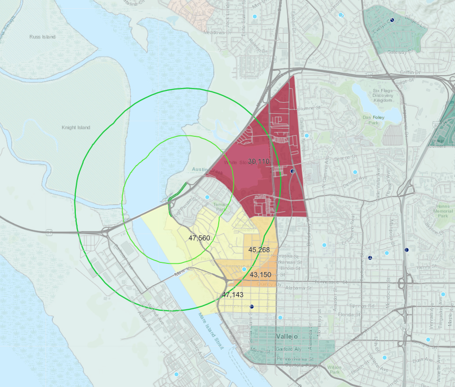

# Documentation
[Proposition 68 Green Infrastructure Grant Program](http://resources.ca.gov/grants/wp-content/uploads/2019/05/Final-Guidelines-1.pdf)-prompted geospatial analysis of a Disadvantaged Communities within a half-mile andf one-mile of a new Bay Trail 2,400 foot bicycle/pedestrian facility of Wilson between Lighthouse Drive and Sacramento Street in Vallejo, CA.  

### Define the Problem Statement  
How many Vallejo residents live within a (1) half-mile and within a (2) one-mile radius of this location on Wilson Avenue
Approx how many of those residents are living in (3), (4) disadvantaged communities within half-mile, one-mile (less than 80% of the State's median household income) and (4), (5) severely disadvantaged communities within half-mile, one-mile (less than 60% of the State's median household income)

| Block groups within Half-mile    | Block groups within One-mile   | 
|----------------------------------|--------------------------------|
| 1 Total Population               | 2 Total Population    	        | 
| 3 Population in DACs*            | 4 Population in DACs	        | 
| 5 Population in S_DACs**         | 6 Population in S_DACs	        | 

*DACs: Disadvantaged communities  
**S_DACs: Severely disadvantaged communities  

[Green Infrastructure Grant Program](http://resources.ca.gov/grants/green-infrastructure/)
The California Natural Resources Agency will be accepting proposals for the Green Infrastructure Program from May 13 through June 28, 2019 via the System for Online Application Review (SOAR) . $18.5 million in awards will be funded by this program. Applicants submitting the most competitive proposals will be invited to participate in the next level of the competitive process, anticipated for late Summer/early Fall 2019.

[Disadvantaged communities in California](https://oehha.ca.gov/calenviroscreen/sb535) are specifically targeted for investment of proceeds from the State’s cap-and-trade program. These investments are aimed at improving public health, quality of life and economic opportunity in California’s most burdened communities at the same time reducing pollution that causes climate change.  

### Project Management 

- [Asana Project](https://app.asana.com/0/797943099119526/1127981031274287) 
- [Box](https://mtcdrive.box.com/s/5r25e366pxxw84vsosjrod1nmonz4wuu)

### Contents 

- [Data Sources](#data-sources)
- [Analysis Parameters](#analysis-parameters)
- [Methodology](#methodology)
- [Expected Outcomes](#expected-outcomes)
- [Results](#results)

## Data Sources  

[Proposition 68 Green Infrastructure Grant Program](http://resources.ca.gov/grants/wp-content/uploads/2019/05/Final-Guidelines-1.pdf)  
[Parksforcalifornia.org/communities](https://mtc.maps.arcgis.com/home/item.html?id=4855a666bbd9426a99618b2f5eaea827&view=table#overview)  
[Parksforcalifornia.org/methods](https://www.parksforcalifornia.org/methods)  
[Bay-Trail](https://mtc.maps.arcgis.com/home/item.html?id=7555b7dd7da546db8196241292e58144)  
[Public Schools](https://mtc.maps.arcgis.com/home/item.html?id=0b2288a1b781479781f4553542020dd6)  
[Private Schools](https://mtc.maps.arcgis.com/home/item.html?id=4a6e98bdac9e46a992d69f3e98d45b8f)  
[Disadvantaged-Communities Definition](https://www.cpuc.ca.gov/discom/)  
[Disadvantaged-Communities data download](https://www.parksforcalifornia.org/communities)  
[2018-2023 USA Population Growth via Living Atlas](https://mtc.maps.arcgis.com/home/item.html?id=42fc3a7efb914256b4e4707bd1b00847)  
 
## Analysis Parameters  
1. Disadvantaged Community - means a community with an annual median household income less than 80 percent of the statewide average  
2. Severely Disadvantaged Community - means a community with a median household income less than 60 percent of the statewide average  
Source:   

## Methodology  

1. Buffer 2,400ft Wilson Ave segment of Bay Trail by half-mile, one-mile 
2. Select by Location the [Census Block Groups Total Population](https://mtcdrive.box.com/s/pfsf6e0wf5rr5rxl345c0v63pwuwvrsv) with in half-mile, one-mile then flag accordingly 
3. 

## Expected Outcomes

An tabluar summary with an interactive AGOL web map for deeper insights and groundtruthing.  

## Final Data Results  

| Block groups within Half-mile     | Block groups within One-mile        | 
|-----------------------------------|-------------------------------------|
| 1 Total Population: 9,836         | 2 Total Population: 14,002  	      | 
| 3 Population in DACs*: 8,745      | 4 Population in DACs: 8,745         | 
| 5 Population in S_DACs**: 2,845   | 6 Population in S_DACs: 2,845       |   

*DACs: Disadvantaged communities  
**S_DACs: Severely disadvantaged communities   

### Final Web Map Results  

[Bay Trail Wilson Ave Disadvantaged Communities Analysis (ACS 2018)Webmap](https://mtc.maps.arcgis.com/home/item.html?id=39e3e7cac4c1426190a7d7c88037eb49)  

