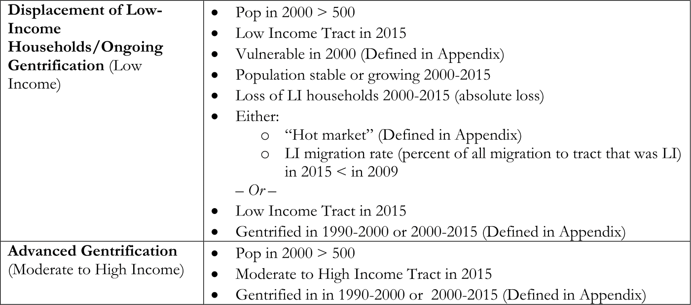

**Draft Status: Draft**

## CASA Equity Analysis

Identify the geographic impacts of the [CASA Compact](https://mtc.ca.gov/sites/default/files/CASA_Compact.pdf) as adopted by the CASA Technical Committee on December 3, modified before appproval by the CASA Steering Committee on December 12, and authorized for Commission Chair signiature by the MTC on December 19, 2018.

### Project Management

- [Asana Project](https://app.asana.com/0/356840529458476/913179078257017/f)
- [Box](https://mtcdrive.box.com/s/32q1ukuaifx0n7fowwowmsm97gohdtf7)

### Contents 

- [Data Sources](#data-sources)
- [Analysis Parameters](#analysis-parameters)
    -[Low Income Renters](#low-income-tenure)
    -[Displacement Risk Areas](#displacement-risk-areas)
    -[High-Opportunity Areas](#high-opportunity-areas)
    -[Transit Access Areas](#transit-access-areas)
    -[Parcels Zoned for Housing](#parcels-zoned-for-housing)
    -[Bay Area Applicability for SB 35](#bay-area-applicability-for-sb-35)
    -[Public Lands, Displacement Risk, and High Opportunity Areas](#public-lands-displacement-risk-and-high-opportunity-areas)
    -[Sensitive Communities](#sensitive-communities)
- [Methodology](#methodology)
    -[Low Income Renters](#low-income-tenure)
    -[Displacement Risk Areas](#displacement-risk-areas)
    -[High-Opportunity Areas](#high-opportunity-areas)
    -[Transit Access Areas](#transit-access-areas)
    -[Parcels Zoned for Housing](#parcels-zoned-for-housing)
    -[Bay Area Applicability for SB 35](#bay-area-applicability-for-sb-35)
    -[Public Lands, Displacement Risk, and High Opportunity Areas](#public-lands-displacement-risk-and-high-opportunity-areas)
    -[Sensitive Communities](#sensitive-communities)
- [Expected Outcomes](#expected-outcomes)
    -[Low Income Renters](#low-income-tenure)
    -[Displacement Risk Areas](#displacement-risk-areas)
    -[High-Opportunity Areas](#high-opportunity-areas)
    -[Transit Access Areas](#transit-access-areas)
    -[Parcels Zoned for Housing](#parcels-zoned-for-housing)
    -[Bay Area Applicability for SB 35](#bay-area-applicability-for-sb-35)
    -[Public Lands, Displacement Risk, and High Opportunity Areas](#public-lands,-displacement-risk,-and-high-opportunity-areas)
    -[Sensitive Communities](#sensitive-communities)
- [Results](#results)

## Data Sources

- [U.S. Census - American Community Survey 2012-2016](https://www.census.gov/programs-surveys/acs/)
- [U.S. Census - TIGER/Line Shapefiles 2016](https://www.census.gov/geo/maps-data/data/tiger-line.html)
- [MTC Communities of Concern (2018)](https://mtc.maps.arcgis.com/home/item.html?id=1501fe1552414d569ca747e0e23628ff)
- [BCDC Communities of Concern]  

## Analysis Parameters

###Low Income Renters###

The table below provides the calculations that need to be performed to get Disadvantage Factor populations and Disadvantage Shares. To translate from variable to written description, please review the [ACS Table Variables Lookup for Low Income Tenure](CASA\Data\Low-Income-Tenure\ACS_Table_Variables_lowincome.csv). ACS Variables are also defined on the American Community Survey (ACS) website. To get variable definitions as well as the layout of tables without the estimates or margins of error filled in, download [2016 ACS Detailed Table Shells](https://www2.census.gov/programs-surveys/acs/summary_file/2016/documentation/user_tools/ACS2016_Table_Shells.xlsx) as an Excel spreadsheet. 

The link below provides the COC schema and domains, along with calculations and written descriptions of the calculations which may be helpful for analysis purposes. Below the link is a table for informational purposes. 

###Dispalcement Risk Areas###
High-displacement risk areas are defined as American Community Survey 2009-2013 tracts where more than 39% of households are low income (below 200% of the Federal Poverty Level) and are undergoing displacement or are experiencing advanced gentrification as defined as the UC Berkeley Urban Displacement Project. The table and term definitions below define the two latter terms for informational purposes.

**UDP Term Definitions**

- Vulnerable to gentrification in 1990 or 2000 (at least 3 out of 4 of the following indicators):
    - % low income households > regional median
    - % college educated < regional median
    - % renters > regional median
    - $ nonwhite > regional median
- "Hot Market" in 2000 or 2015
    - Change in median real rent > regional median
    or
    - Change in median value for owner-occupied homes > regional median
- Gentrification from 1990 to 2000 or 2000 to 2015
    - Vulnerable in base year (as defined above)
    - Demographic change between base and end years (at least 2 of 3 occurring):
        - Growth in % college educated > regional median
        - Growth in real median household income (percent change) > regional median
        - Lost low-income households
    - LI migration rate (percent of all migration to tract that was LI) in 2015 < in 2009 (only used for 2000-2015 time frame)
    - "Hot market" (defined above)

###High Opportunity Areas###
High-opportunity areas are defined as the California Tax Credit Allocation Committee / Housing & Community Development high and highest resource categories. To get definitions for CTCAC / HCD resource categories, please refer to the California Fair Housing Task Force's [Opportunity Mapping Methodology](https://www.treasurer.ca.gov/ctcac/opportunity/final-opportunity-mapping-methodology.pdf).

###Transit Access Areas###

###Parcels Zoned for Housing###

###Bay Area Applicability for SB 35###

###Public Lands, Displacement Risk, and High Opportunity Areas###

###Sensitive Communities###

## Methodology

###Low Income Renters###
The analysis was performed in R and leverages the censusapi library which is documented here: [CensusAPI](https://hrecht.github.io/censusapi/index.html)

To explore the methodology, take a look at the [Low Income Tenure Methodology](CASA_acs_vars_lowincomeTenure.Rmd)

## Expected Outcomes

###Low Income Renters###

- Feature class that displays low income renters by race and share paying greater than 30% of income on housing
	- Feature class name: ***CASA\Data\Low-Income-Tenure\lowincomeTenure_ACS2016_tbl.csv***
	- [Feature Class Schema](???) 
- Print map of low income tenure

###Sensitive Communities###
- Feature class that contains Census Tracts meeting CASA Sensitive Communities criteria
	- Feature class name: ***???***
	- [Feature Class Schema](???)  
- Print map of CASA Sensitive Communities

## Results

[Racial Equity Analysis for the CASA Compact](https://mtc.ca.gov/sites/default/files/Racial_Equity_Analysis_for_the_CASA_Compact.pdf)

## Related Works

[Sensitive Communities Threshold Analysis](https://github.com/BayAreaMetro/Spatial-Analysis-Mapping-Projects/tree/master/Project-Documentation/COC-TPA-Thresholds-App)  
[MTC Communities of Concern](https://github.com/BayAreaMetro/Spatial-Analysis-Mapping-Projects/tree/master/Project-Documentation/Communities-of-Concern)