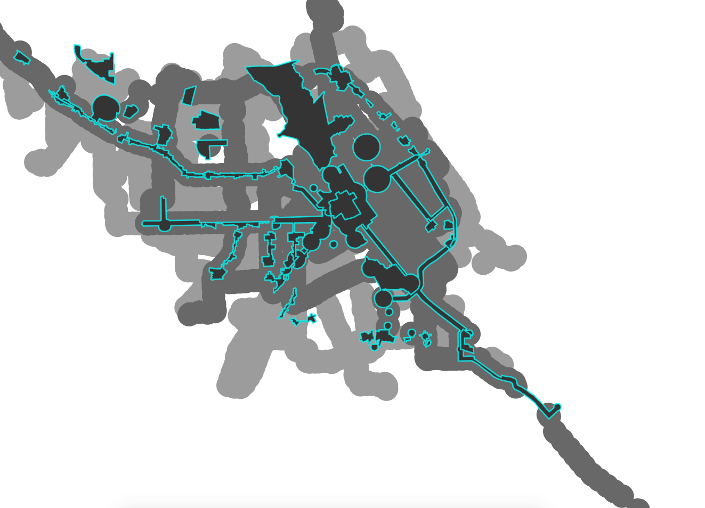
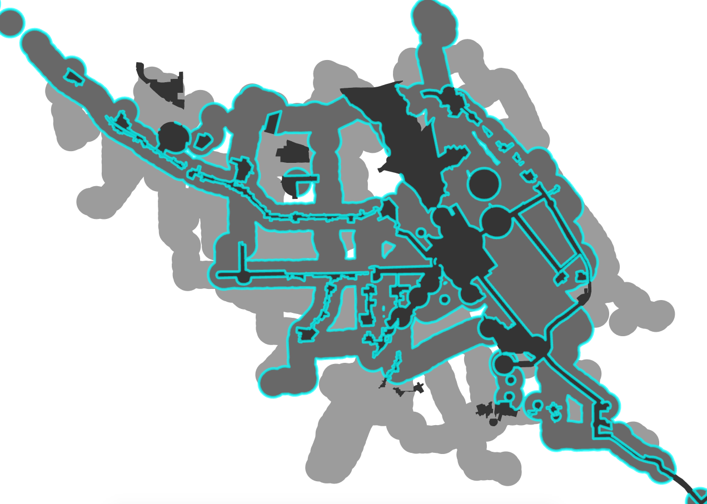
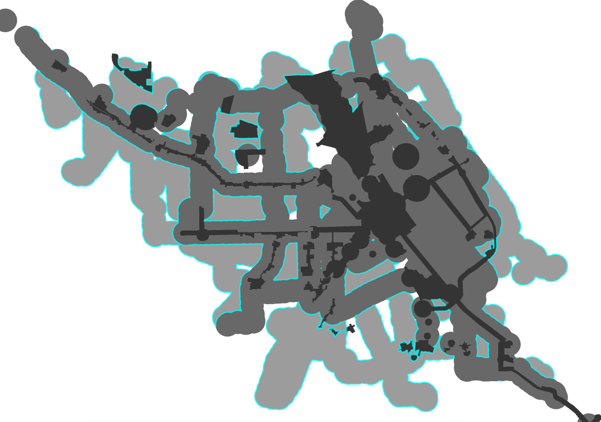
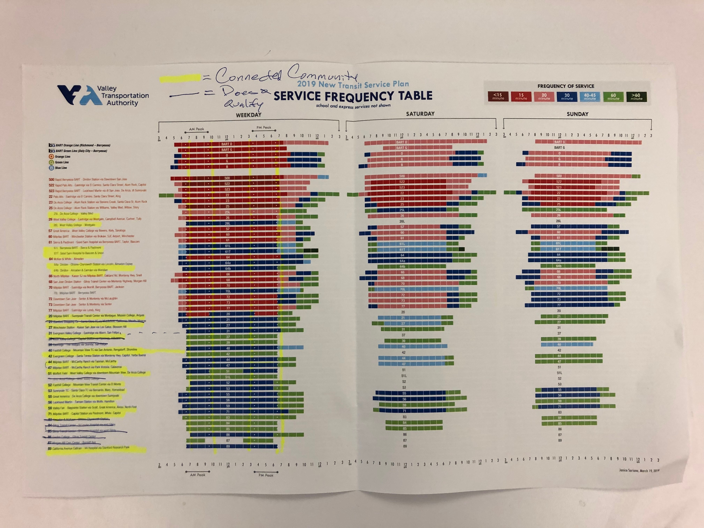

# Documentation  

##### Existing PDA

##### Eligible PDA based on Passenger Rail and 15 minute or less bus frequency

##### Eligible PDA based bus frequency greater than 15 minute but less than 30 mins

The Eligible PDAs were calculated for the purposes of Santa Clara County Outreach Meetings where Priority Development Areas (PDAs) were dicussed. Prior to meeting the 30min eligible PDAs were not determined.

##### Santa Clara County -PDA & Frequent Transit

##### North Santa Clara County -PDA & Frequent Transit

##### West Valley Santa Clara County -PDA & Frequent Transit

##### Central Santa Clara County -PDA & Frequent Transit

##### South Santa Clara County -PDA & Frequent Transit

##### South Santa Clara County -PDA & Frequent Transit

### Define the Problem Statement  

Areas within a 1/2 mile from a high frequency transit stop are where land use development are prioritized. If the area around transit stops changes, how do we account for those modifications? What is the definition of 'frequent transit'? In terms of this request and PDA determination, 'frequent transit' refers to a station/stop severed by transit '15 minutes or less' on weekdays.

### Project Management 

- [Asana Project](https://app.asana.com/0/797943099119526/1127245730275646) 
- [Box](https://mtcdrive.box.com/s/uvbplf3z741q2qsoyw5q48wot0nz81oi)

### Contents 

- [Data Sources](#data-sources)
- [Analysis Parameters](#analysis-parameters)
- [Methodology](#methodology)
- [Expected Outcomes](#expected-outcomes)
- [Results](#results)

## Data Sources  
[GTFS](https://mtcdrive.box.com/s/nscbfj2fclud5dpg7us8euo5q2jm927q)  
[VTA Next Network](https://mtcdrive.box.com/s/mx0seqy8ttuwj63ri2pvgfkdiueqd9yj)  
[Priority Development Areas (PDAs)](https://mtc.maps.arcgis.com/home/item.html?id=36dd7a36576f42d4a3d6b0708e3982f4)  
[Public Lands for Workforce Housing](https://mtc.maps.arcgis.com/home/item.html?id=56d1134a3e904ab09fef13b4954f3ede)  
[Passenger Rail Stations](https://mtc.maps.arcgis.com/home/item.html?id=efd75b7bb3c04dbda06c6e7cd73e9336)  
[Passenger Railways](https://mtc.maps.arcgis.com/home/item.html?id=a6512b81bd1b47a895bf18687e2600e6)  
[BART Station Extensions](https://mtc.maps.arcgis.com/home/item.html?id=6359122a19c14d1fa8df2e4bf1d76001)  
[BART Railway Extensions](https://mtc.maps.arcgis.com/home/item.html?id=f614cdd2948e4d679b07c8ac284a2203)  
    
## Analysis Parameters  
1. Current Priority Development Areas (PDAs)
2. 15min Eligible Priority Development Areas (PDAs) 
    = Half-mile circular buffer around:  
        A. Santa Clara County's current and planned Passenger Rail stations 
        B. VTA Next Network high frequency bus routes (15mins or less headways)

3. 30min Eligible Priority Development Areas (PDAs) 
    = Half-mile circular buffer around:  
        A. VTA Next Network high frequency bus routes (greater than 15mins but less than 30mins headways)  
        B. Qualitative Service Frequency Table analysis
          

## Methodology  
1. Eligible PDA _15min = Buffer the 15 minute headway bus stops
2. Erase existing PDA from Eligible PDA _15min
3. Eligible PDA _30min = Buffer the bus stops with headway greater than 15mins and less than 30mins
4. Erase Eligible PDA _15min from Eligible PDA _30min 

## Expected Outcomes  
Inform the 2050 Plan Bay Area Outreach process of existing and eligible Priority Development Areas.   

## Results  
[Eligible Priority Development Areas](https://mtcdrive.box.com/s/jobdc5bffwgwm8bj5aaaz7sbpfmekqx4)