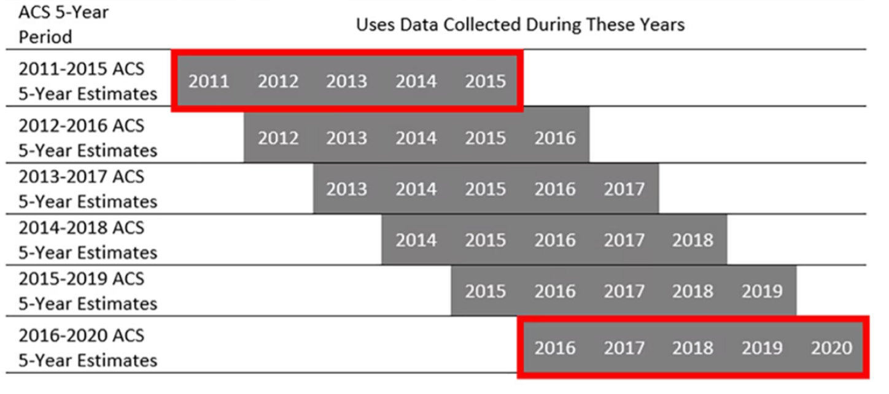

**Documentation Status: DRAFT**

## MTC Plan Bay Area 2050+ Equity Priority Communities <!-- omit in toc -->

Identify census tracts within the Bay Area that are considered a Equity Priority Communities (EPCs) (formerly referred to as Communities of Concern (CoC)) as defined by [MTC Resolution No. 4217-Equity Framework for Plan Bay Area 2040](https://mtc.legistar.com/LegislationDetail.aspx?ID=2555452&GUID=575A6D3F-B8B8-44CF-9F2D-ABEF8B3C9F06&Options=ID|Text|&Search=%22communities+of+concern%22)
The Joint MTC Planning Committee with the ABAG Administrative Committee approved renaming “Communities of Concern (CoCs)” as “Equity Priority Communities (EPCs)” for use across our work products and programs on May 14, 2021 (refer to materials [here](http://mtc.legistar.com/gateway.aspx?M=F&ID=c275daaf-8f8e-4b82-a44f-d4ff9b053e4c.pdf)). 

### Project Management 

- Box Directories
	- [Plan Bay Area 2050+ Work Products](https://mtcdrive.box.com/s/f233vrryr4ma2oza01029be9l9dgj3z8)
		- Includes all data, analysis, and visualizations associated with Plan Bay Area 2050+ Equity Priority Communities
	- [Equity Priority Communities Other Work Products](https://mtcdrive.box.com/s/u2o6tj4tekphcfv2r2y8alnf5yypwida)
    	- Includes all data, analysis, and visualizations related to all regional Equity Priority Communities work products outside of Plan Bay Area 2050+

### Table of Contents
- [Data Sources](#data-sources)
- [Analysis Parameters](#analysis-parameters)
	- [Equity Priority Communities Framework Plan Bay Area 2050](#equity-priority-communities-framework-plan-bay-area-2050)
	- [Summary of MTC EPC Demographic Factors \& Demographic Factor Definitions](#summary-of-mtc-epc-demographic-factors--demographic-factor-definitions)
- [Methodology](#methodology)
	- [Processing Tools and Code](#processing-tools-and-code)
	- [Calculate MTC EPC Demographic Factor Population from ACS Variable Populations](#calculate-mtc-epc-demographic-factor-population-from-acs-variable-populations)
- [Expected Outcomes](#expected-outcomes)
- [Results](#results)
- [Related Works](#related-works)

## Data Sources

- [U.S. Census - American Community Survey API](https://www.census.gov/data/developers/data-sets/acs-5year.html)
- [U.S. Census - TIGERweb REST API Generalized_ACS2022/Tracts_Blocks 2022](https://tigerweb.geo.census.gov/arcgis/rest/services/Generalized_ACS2022/Tracts_Blocks/MapServer/3)

## Analysis Parameters

The 2024 update of MTC's Equity Priority Communities follows the Equity Priority Communities Framework for Plan Bay Area 2050+, and is based on on 2018-2022 American Community Survey (ACS) 5-year tract level data. The MTC EPC Framework is provided below as well as a summary table which provides the 8 EPC demographic factors, definitions of demographic factors, census-tract concentration thresholds, relevant ACS table variables, and ACS variable definitions. 

### Equity Priority Communities Framework Plan Bay Area 2050+

| Demographic Factor                               | Mean of  Tract-Level Shares | Standard  Deviation  (SD) | .5 SD  _PBA2050+ Threshold_ (High EPC) | 1 SD  (Higher EPC) | 1.5 SD  (Highest EPC) |
|--------------------------------------------------|-----------------------------|---------------------------|----------------------------------------|--------------------|-----------------------|
| **People of Color**                              | 61%                         | 23%                       | 72%                                    | 84%                | 96%                   |
| **Low-Income (<200% Federal Poverty Level-FPL)** | 18%                         | 13%                       | 24%                                    | 31%                | 38%                   |
| Limited English Proficiency                      | 7%                          | 8%                        | 11%                                    | 15%                | 19%                   |
| Zero-Vehicle Household                           | 10%                         | 13%                       | 16%                                    | 23%                | 30%                   |
| Seniors 75 Years and Over                        | 7%                          | 6%                        | 10%                                    | 13%                | 16%                   |
| People with Disability                           | 10%                         | 5%                        | 12%                                    | 15%                | 18%                   |
| Single Parent Families                           | 12%                         | 9%                        | 16%                                    | 21%                | 26%                   |
| Severly Rent-Burdened                            | 10%                         | 8%                        | 14%                                    | 18%                | 22%                   |

Definition: Census Tracts that have a cocentration of BOTH people of color AND low-income households, OR that have a concentration of 3 or more of the remaining 6 factors (#3 to #8) but only IF they also have a concentration of low-income households.

### Summary of MTC EPC Demographic Factors & Demographic Factor Definitions

[ACS Table Variables and MTC EPC Demographic Factors Lookup](Data/ACS_Table_Variables_EPC_Factors.csv)

| Demographic Factor | Demographic Factor Definition | Concentration Threshold |
|---|---|---|
| People of Color | People of Color populations include persons who identify as any of the following groups as defined by the Census Bureau in accordance with guidelines provided by the U.S. Office of Management and Budget: American Indian or Alaska Native Alone (non-Hispanic/non-Latino); Asian Alone (non-Hispanic/non-Latino); Pacific Islander Alone (non-Hispanic/non-Latino); Black or African-American Alone (non-Hispanic/non-Latino); and Other (Some Other Race, Two or More Races, non-Hispanic/non-Latino); and all Hispanic/Latino persons. | 72% |
| Low Income (< 200% Federal Poverty Level -FPL) | Person living in a household with incomes less than 200% of the federal poverty level established by the Census Bureau. | 24% |
| Limited English Proficienty | Person above the age of 5 years, who do not speak English at least "well" as their primary language or had a limited ability to read, speak, write, or understand English at least "well", as defined by the U.S. Census. | 11% |
| Zero-Vehicle Household | Households that do not own a personal vehicle. | 16% |
| Seniors 75 Years and Over | Self-explanatory. | 10% |
| People with Disability | The U.S. Census Bureau defines disability as: Hearing difficulty- deaf or having serious difficulty hearing (DEAR); Vision difficulty- blind or having serious difficulty remembering, concentrating, or making decisions (DREM); Ambulatory difficulty- having serious difficulty walking or climbing stars (DPHY; Self-care difficulty- having difficulty bathing or dressing (DDRS); Independent living difficulty- because of a physical, mental, or emotional problem, having difficulty doing errands alone such as visiting a doctor's office or shopping (DOUT). | 12% |
| Single-Parent Family | Families with at least one child. To determine whether or not single-parent families exceed tract concentration thresholds, **the share of single parent families is calculated as a share of all families regardless of whether or not they have any children.** | 16% |
| Severely Rent-Burdened Household | Renters paying > 50% of income in rent. To determine whether or not severely rent-burdened households exceed tract concentration thresholds, **the share of severely rent-burdened households is calculated as a share of all households regardless of occupancy status (renter or owner).** | 14% |

## Methodology

### Processing Tools and Code

The analysis was performed in python and leverages the American Community Survey (ACS) API which is documented here: [ACS API](https://www.census.gov/data/developers/data-sets/acs-5year.html) and the Census TIGER/Web API for spatial data which is documented here: [TIGER/Web REST API](https://tigerweb.geo.census.gov/tigerwebmain/TIGERweb_restmapservice.html)

To explore the technical processing methods, please review the [EPC Processing Python Notebook](equity_prority_communities_build.ipynb)

### Calculate MTC EPC Demographic Factor Population from ACS Variable Populations

The table below provides the calculations that were performed to get demographic factor populations and demographic shares. To translate from variable to written description, please review the [ACS Table Variables and MTC EPC Demographic Factors Lookup](Data/ACS_Table_Variables_EPC_Factors.csv). ACS Variables are also defined on the American Community Survey (ACS) website. To get variable definitions as well as the layout of tables without the estimates or margins of error filled in, download [2022 ACS Detailed Table Shells](https://www2.census.gov/programs-surveys/acs/summary_file/2022/table-based-SF/documentation/ACS2022_Table_Shells.xlsx) as an Excel spreadsheet. 

The link below provides the EPC schema and domains, along with calculations and written descriptions of the calculations which may be helpful for analysis purposes. Below the link is a table for informational purposes. 

[EPC Schema With Field Descriptions, Population & Share Calculations](Data/epc_schema_pba2050p.csv)

| Demographic Factor                            | Demographic Factor Population Based on ACS Variable Population                                                                                                                                                               | Demographic Factor Population as a Share of Universe (Population, Households, Families)                                                                                                                                                   |
|------------------------------------------------|-------------------------------------------------------------------------------------------------------------------------------------------------------------------------------------------------------------------------------|--------------------------------------------------------------------------------------------------------------------------------------------------------------------------------------------------------------------------------------------|
| People of Color                                | B03002_001E - B03002_003E                                                                                                                                                                                                     | (B03002_001E -B03002_003E)/B03002_001E                                                                                                                                                                                                     |
| Low Income (< 200% Federal Poverty Level -FPL) | C17002_001E - C17002_008E                                                                                                                                                                                                     | C17002_001E -C17002_008E/C17002_001E                                                                                                                                                                                                       |
| Limited English Proficienty                    | B16005_007E + B16005_008E + B16005_012E + B16005_013E + B16005_017E + B16005_018E + B16005_022E + B16005_023E + B16005_029E + B16005_030E + B16005_034E + B16005_035E + B16005_039E + B16005_040E + B16005_044E + B16005_045E | (B16005_007E + B16005_008E + B16005_012E + B16005_013E + B16005_017E + B16005_018E + B16005_022E + B16005_023E + B16005_029E + B16005_030E + B16005_034E + B16005_035E + B16005_039E + B16005_040E + B16005_044E +B16005_045E)/B16005_001E |
| Zero-Vehicle Household                         | B08201_002E                                                                                                                                                                                                                   | B08201_002E/B08201_001E                                                                                                                                                                                                                    |
| Seniors 75 Years and Over                      | B01001_023E + B01001_024E + B01001_025E + B01001_047E + B01001_048E + B01001_049E                                                                                                                                             | (B01001_023E + B01001_024E + B01001_025E + B01001_047E + B01001_048E + B01001_049E)/B01001_001E                                                                                                                                            |
| People with Disability                         | C18108_001E - (C18108_005E + C18108_009E + C18108_013E)                                                                                                                                                                       | (C18108_001E -(C18108_005E + C18108_009E + C18108_013E))/C18108_001E                                                                                                                                                                       |
| Single-Parent Family                           | B11004_010E + B11004_016E                                                                                                                                                                                                     | (B11004_010E + B11004_016E)/B11004_001E                                                                                                                                                                                                    |
| Severely Rent-Burdened Household               | B25070_010E                                                                                                                                                                                                                   | B25070_010E/B08201_001E                                                                                                                                                                                                                    |
## Processing Notes

### 2020 Decennial Census Boundary Changes
Several important changes to Census geographies occurred between 2010 and 2020, which impact the current update to Equity Priority Communities. Many statistical areas, like census tracts and block groups, are updated once per decade to reflect shifts in population and development patterns reported through the decennial Census. Census Bureau guidelines recommend that Census tracts be merged with adjacent tracts when the population is below 1,200 or housing units are below 480. Guidelines recommend splits when tract population is above 8,000 or housing units exceed 3,200. The American Community Survey (ACS) publishes estimates using vintages, representing the latest available geographic boundaries. For the ACS 5-year estimates, the vintage is the last year of the multi-year period.2 For Plan Bay Area 2050, the adopted EPCs are based on ACS 2014-2018 which used 2018 vintage boundaries last changed in 2010. The latest update uses ACS 2018-2022, which uses 2022 vintage boundaries, which were last updated in 2020.  

All counties saw an increase in the number of tracts between Plan Bay Area 2050 and the current update to Plan Bay Area 2050+ EPCs, which the exception of Napa which remained unchanged as shown in Table 1. Census boundaries can be split or merged, or in some cases, boundaries can be modified to enlarge or shrink existing tracts posing challenges for comparisons. Previous updates have contextualized change in terms of absolute values; however, this memorandum will contextualize change in terms of shares due to changes in tract boundaries. 

**Table 1: Change in Number of Tracts by County**

|       county        |      # Tracts PBA 2050 (ACS 2014-2018)  |      # Tracts PBA 2050+ (ACS 2018-2022)   |      Net Change  |
|---------------------|-----------------------------------------|-------------------------------------------|------------------|
|      Alameda        |     361                                 |     379                                   |     18           |
|      Contra Costa   |     208                                 |     242                                   |     34           |
|      Marin          |     56                                  |     63                                    |     7            |
|      Napa           |     40                                  |     40                                    |     0            |
|      San Francisco  |     197                                 |     244                                   |     47           |
|      San Mateo      |     158                                 |     174                                   |     16           |
|      Santa Clara    |     372                                 |     408                                   |     36           |
|      Solano         |     96                                  |     100                                   |     4            |
|      Sonoma         |     100                                 |     122                                   |     22           |
|      Total          |     1588                                |     1772                                  |     184          |

Sources:
- [U.S. Census Bureau, 2018 November 19, 2020 Census Participant Statistical Areas Program (PSAP) Quick Reference: Census Tracts](https://www2.census.gov/geo/pdfs/partnerships/psap/G-650.pdf)
- [U.S Census Bureau, Geography and the American Community Survey: What Data Users Need to Know. Census.gov](https://www.census.gov/programs-surveys/acs/library/handbooks/geography.html)

### Impact of COVID-19 Pandemic on American Community Survey (ACS) Data Collection
In 2020-2021, the American Community Survey (ACS) faced significant hurdles in data collection due to the COVID-19 pandemic, resulting in only two-thirds of the typical responses being gathered. In 2020, the ACS changed their survey collection protocol, suspending mail operations starting mid-March through June 2020. Limited mail operations were resumed in July 2020. The full 5-piece mail strategy was resumed in April 2021, impacting both 2020 and 2021 collection. During this modified protocol, the internet option was available only to a subset of the full sample due to reduced mailings during April-June 2020.3   

Consequently, the 2020 segment of the 2016-2020 5-year estimates experienced a notable increase in margins of error, rising by approximately 15-20% relative to previous years. This spike underscores the importance of considering margins of error, particularly in comparisons involving smaller geographic areas or populations, where accuracy is paramount. Moreover, comparing the 2016-2020 ACS 5-year estimates presents additional challenges. Changes in weighting methodologies were introduced to mitigate nonresponse bias issues specific to the 2020 dataset, but the dynamic nature of population changes and the ACS's ability to capture them pose ongoing challenges. Multiyear estimates tend to smooth out abrupt shifts, potentially obscuring meaningful fluctuations, while the absence of 2020 Census results further complicates population controls within the ACS framework. These complexities emphasize the necessity of a nuanced approach and cautious interpretation when utilizing and comparing the 2016-2020 ACS 5-year estimates in analytical contexts.4  

ACS 2016-2020 estimates were not the only ones impacted by COVID-19 data collection issues. According to the user notes the Census Bureau continues to publish data despite it not meeting their quality standards, meaning that margins of error are higher than is typical. Users are cautioned about using estimates with high margins or error and the Census anticipates that these errors will persist in future 5-year products containing 2020 data including ACS 2018-2022.

Sources:
- [U.S. Census Bureau, 2021 November 5, American Community Survey Impact from the COVID-19 Pandemic](https://www2.census.gov/about/partners/cac/nac/meetings/2021-11/presentation-american-community-survey-experience-2020-data.pdf)
- [U.S. Census Bureau, Experimental Data and the Impact of ACS Collection Challenges on CTPP and other Data Products](https://transportation.org/ctpp/wp-content/uploads/sites/83/2023/08/Raglin_Experimental-Data.pdf)
- [U.S. Census Bureau, Increased Margins of Error in the 5-Year Estimates Containing Data Collected in 2020. Census.gov](https://www.census.gov/programs-surveys/acs/technical-documentation/user-notes/2022-04.html)

### Understanding American Community Survey Estimates
MTC relies heavily on the American Community Survey to understand regional social, housing, economic and demographic change. Every four years Equity Priority Communities data are updated using ACS data which informs planning, investment, and community engagement decision making. Given the importance of these data to our region, it is essential that decision makers have a clear understanding of the product and how it should be used. 

Unlike the Census, ACS estimates are “period estimates” meaning they represent data for a specific period of time rather than for a specific date. The ACS collects surveys over the course of a year for 1-year estimates and over 5-years for 5-year estimates. It is often assumed that the methodology applied to develop 5-year estimates involves taking 1-year estimates, adding them up, and dividing by 5. However, data collected over the period are pooled together, weighted, and processed taking advantage of the larger sample size.  

The ACS releases updated 5-year estimates each year, or what is known as a “rolling 5-year period”. Data from the oldest year gets dropped and data for the newest year included, in other words 40% of the data changes. It is common for users interested in comparing how data have changed from one period to the next, however that is a statistically inaccurate approach. For example, users trying to understand the impact of the COVID-19 pandemic might try to compare data from overlapping 5-year periods such as between 2015-2019 and 2016-2020. Instead of comparing the difference between 2019 and 2020, users are measuring the difference between the nonoverlapping portions 2015 and 2020. Because of this, the Census Bureau strongly recommends against comparing estimates in overlapping 5-year periods since much of the data in each estimate are the same.  Figure 1 below provides examples of ACS 5-Year period estimates that would be accurate to compare.  

**Figure 1: Example Highlighting Nonoverlapping ACS 5-Year Estimates**

Sources:
- [U.S. Census Bureau, Period Estimates in the American Community Survey. Census.gov](https://www.census.gov/newsroom/blogs/random-samplings/2022/03/period-estimates-american-community-survey.html)

## Expected Outcomes

- Feature class that contains Census Tracts meeting MTC Equity Priority Communities criteria
	- Feature class name: 
	- [Feature Class Schema](Data/EPC_Schema_pba2050.csv) 
- Web layer that contains Census Tracts meeting MTC Equity Priority Communities criteria 
- Print map of MTC Equity Priority Communities

## Results

- [PBA 2050+ Equity Priority Communities - ACS 2022](Data/epc_acs2022.csv)
- [PBA 2050+ Equity Priority Communities - ACS 2022 Web Layer (Not Published Yet)]()
- [PBA 2050+ Equity Priority Communities Print Map (Internal)](https://mtcdrive.box.com/s/k5brposx9cv4vwimu4g06240i1p7ak7k)
- [PBA 2050 and PBA 2050+ Equity Priority Communities Comparison Map (Internal)](https://mtcdrive.box.com/s/r052gafjftdazgtujhh9y4bci20wj6ku)
- [PBA 2050 and PBA 2050+ Equity Priority Communities Comparison Interactive Web Map (Internal)](https://experience.arcgis.com/experience/44ea7e82901e4132bc577328cec515ef/)
- [Equity Priority Communities Comparison Tool Tableau (Internal)](https://10ay.online.tableau.com/#/site/metropolitantransportationcommission/workbooks/1400140/views)

## Related Works
- [Plan Bay Area 2050 Equity Priority Communities](README_EPC_ACS2018.md)
- [Communities of Concern Update with American Community Survey 2012-2016 Data](README_COC_ACS2016.md)
- [BARC Disadvantaged and Vulnerable Communities](https://mtcdrive.box.com/s/kgljawtrqdwvpv01n47kenmdnq9gvpt6)
- [SB 535 Disadvantaged Communities (EPA Calenviroscreen 3.0)](https://oehha.ca.gov/calenviroscreen/sb535)
- [BAAQMD CARE Communities](https://www.baaqmd.gov/community-health/community-health-protection-program/community-air-risk-evaluation-care-program)

