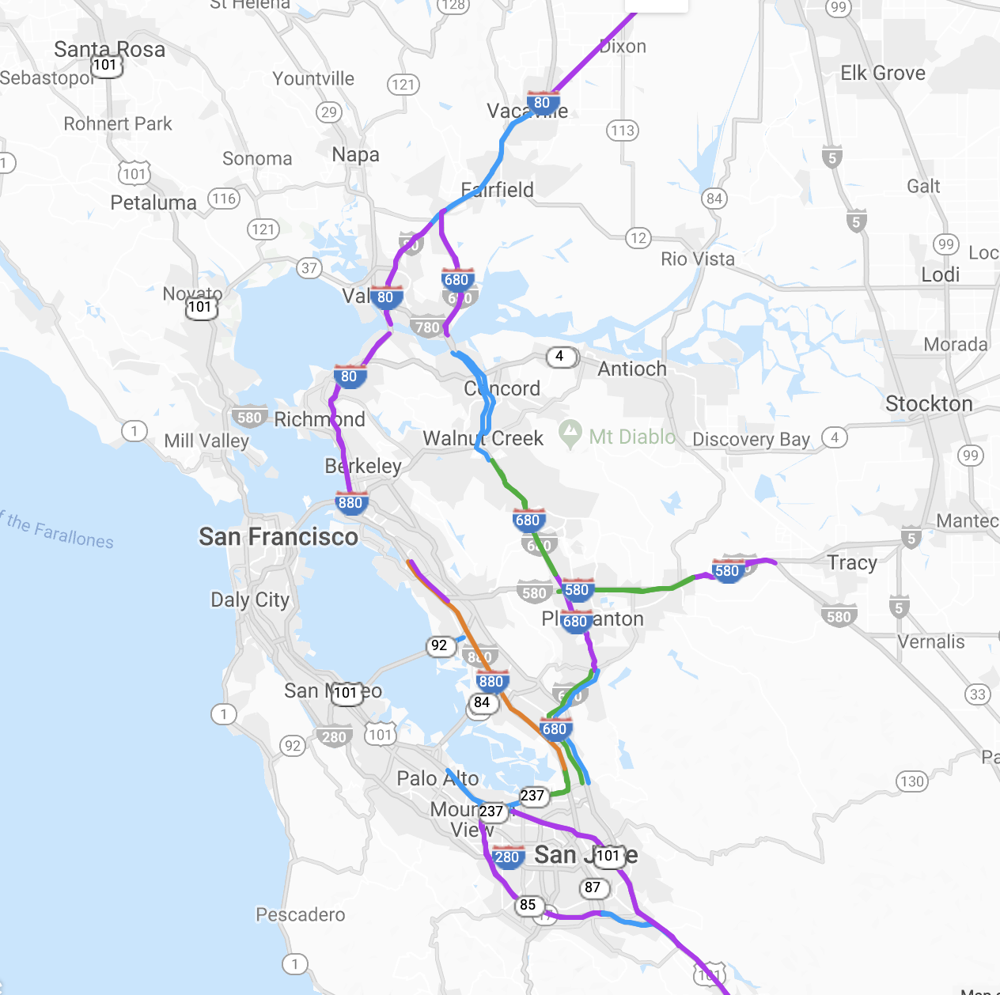
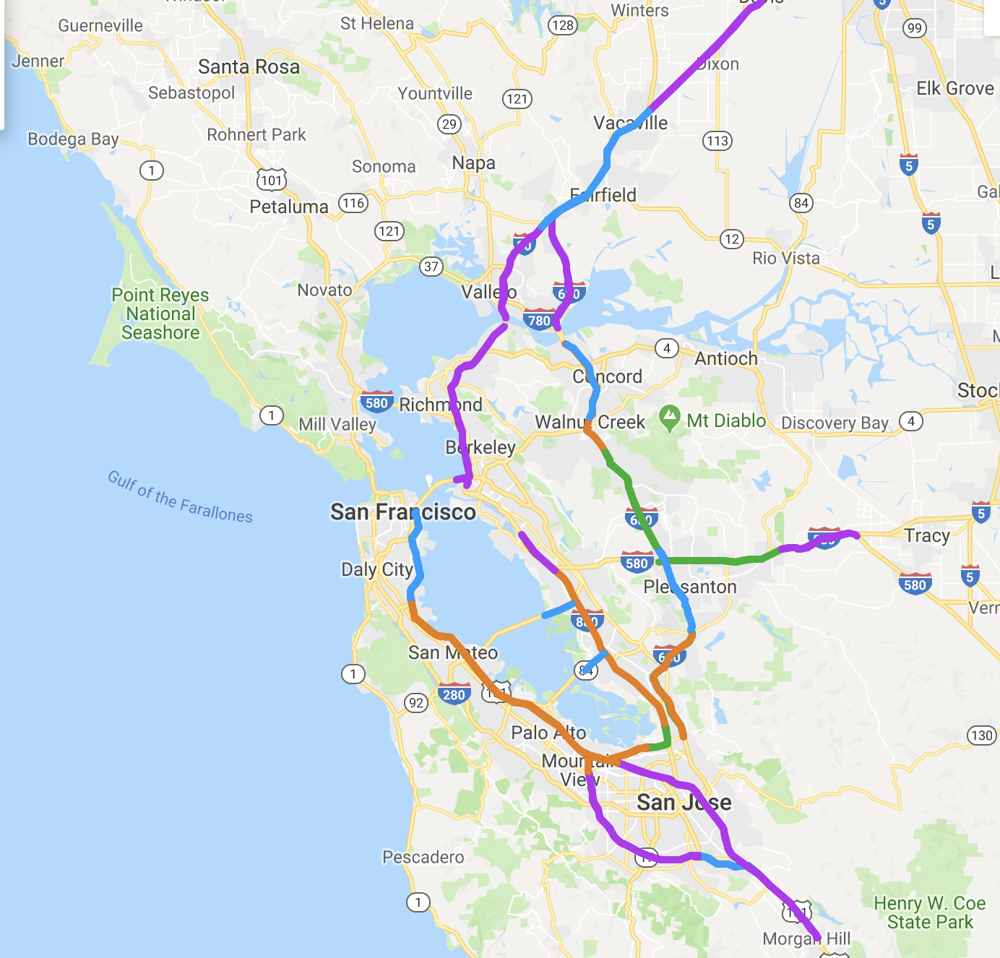
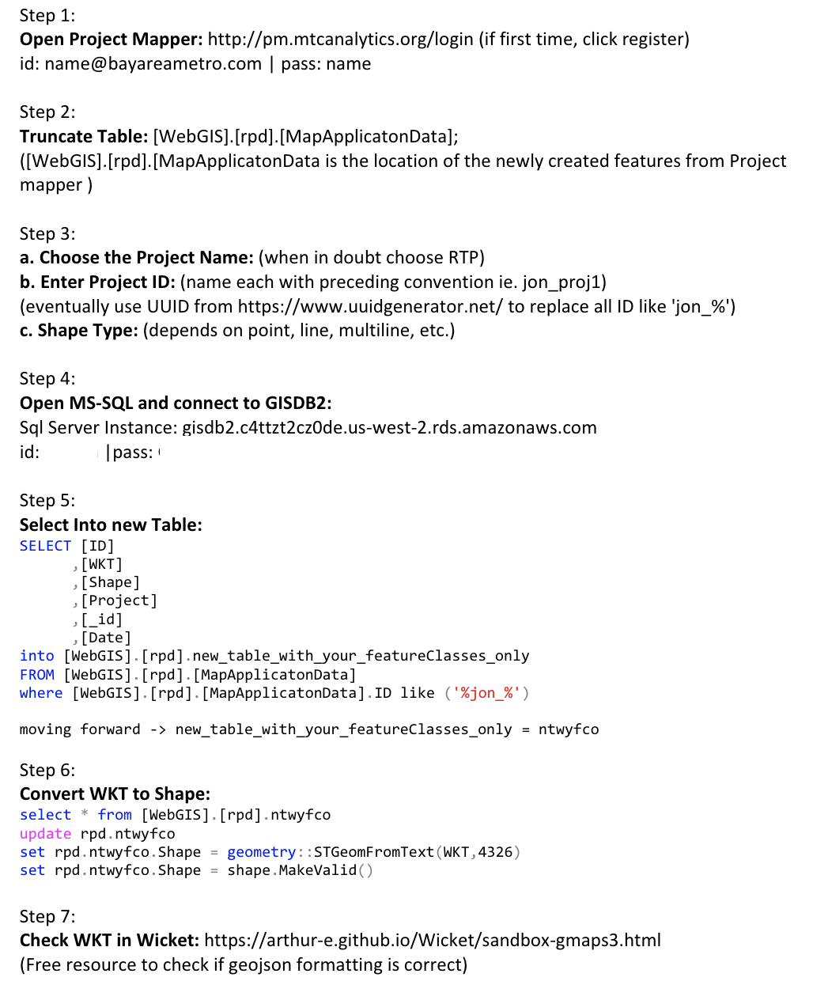

# Documentation  

Updating the previous [BAIFA Bay Area Express Lanes Online Map](http://bael.mtcanalytics.org/map/) to the latest [BAIFA Bay Area Express Lanes Online Map](http://bael-dev-bucket.s3-website-us-west-2.amazonaws.com/). New express lanes come online, new lanes are being planned, and some lanes being designed and/or constructed.

add prior dataset table:

add updated dataset table:

### Define the Problem Statement  

How do we inform the public planning process of the Bay Area HOV/Carpool/Express Lanes? An online map! With data tables, charts and methods documented on github.
  
### Project Management 

- [Asana Project](https://app.asana.com/0/797943099119526/1121523625258411) 
- [Box](https://mtcdrive.app.box.com/folder/76004137238)

### Contents 

- [Data Sources](#data-sources)
- [Analysis Parameters](#analysis-parameters)
- [Methodology](#methodology)
- [Expected Outcomes](#expected-outcomes)
- [Results](#results)

## Data Sources  

Prior:

Update:
[Bay Area Express Lanes](https://data.bayareametro.gov/dataset/Bay-Area-Express-Lanes-2019-/t7di-4itt)
    
## Analysis Parameters  

Update the BAIFA/Express Lanes Bay Area Online Map for all 9 Bay Area Counties according to the data provided by internal staff

## Methodology 

## Results   

Inform the Bay Area of the latest Express Lane projects and developments via [BAIFA Bay Area Express Lanes Online Map](http://bael-dev-bucket.s3-website-us-west-2.amazonaws.com/).

draft coc 
- [2018 Communities of Concern - ACS 2016](Data/COCs_ACS2016_tbl.csv)
- [2018 Communities of Concern - ACS 2016 Geography (Urban Tracts) Web Layer](http://opendata.mtc.ca.gov/datasets/mtc-communities-of-concern-2018-with-american-community-survey-data-2012-2016)

