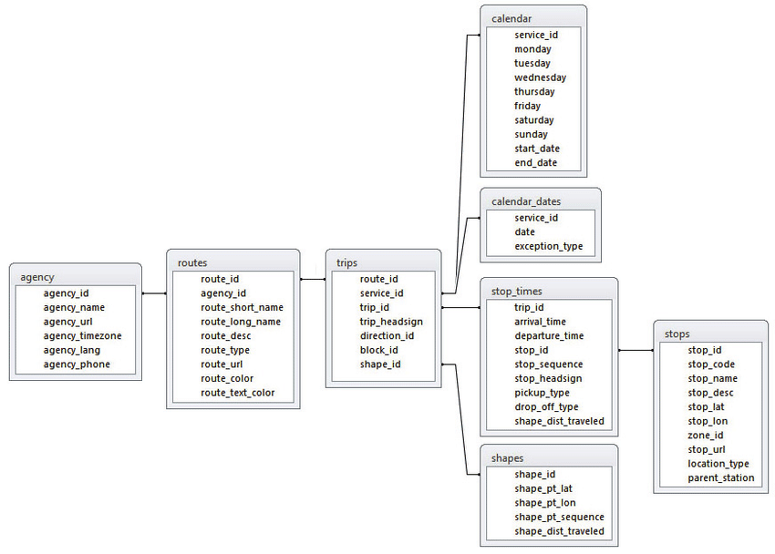

-- Draft --

# Plan Bay Area 2050 Transit Data Updates

### Define the Problem Statement

Map new and existing transit stops as well as rail, ferry, and bus stops served by routes meeting certain headway criteria for peak periods. 

### Project Resources

- [Asana Project - PBA 2050 Transit Data](https://app.asana.com/0/229355710745434/1177953172585985)
- [Box Directory](https://mtcdrive.box.com/s/ahdbq95qsuhpov42cmut147qp70sgj1g) 

## Data Sources

- [511 Regional GTFS API January 2020](https://511.org/open-data/transit)
	- [Historic GTFS Data (MTC Access Only)](https://mtcdrive.box.com/s/704dfa2xadbcn91youc7pcaccnrlmvu1)
- [All Potential PBA 2050 Blueprint Stations (MTC Access Only)](https://mtcdrive.box.com/s/zn6geq8qtgh1gb88c28k1mdwbnlwfeg2)

## Analysis Parameters

### GTFS Relational Diagram

[General Transit Feed Specification (GTFS) Reference](https://github.com/google/transit/blob/master/gtfs/spec/en/reference.md#stopstxt)

### Planned or New Transit Stops

### Existing Transit Stops

The existing transit stops dataset includes all transit stops for the Bay Area, including attributes that indicate level of service for routes served by them. The table below provides the columns that will contain level of service information as well as a description of the level of service criteria, such as headway threshold, time period, number of routes served, or route type. 

| Field Name Long    | Description                                                                                                                                                                                                                                                                                                                           | Domain                                                      |
|--------------------|---------------------------------------------------------------------------------------------------------------------------------------------------------------------------------------------------------------------------------------------------------------------------------------------------------------------------------------|-------------------------------------------------------------|
| Average Headway AM | Average of all route headways for routes that visit the stop during the AM (6:00 - 10:00 AM) commute period                                                                                                                                                                                                                           |                                                             |
| Average Headway PM | Average of all route headways for routes that visit the stop during the PM (3:00 - 7:00 PM) commute period                                                                                                                                                                                                                            |                                                             |
| Headway 30 Minute  | Flag field for stops served by 1 or more transit routes with headways of 30 minutes or less during BOTH the AM (6:00 - 10:00 AM) and PM (3:00 - 7:00 PM) peak commute period                                                                                                                                                          | 0; 1                                                        |
| Headway 15 Minute  | Flag field for stops served by 1 or more transit routes with headways of 15 minutes or less during BOTH the AM (6:00 - 10:00 AM) and PM (3:00 - 7:00 PM) peak commute perio                                                                                                                                                           | 0; 1                                                        |
| Major Transit Stop | To qualify as a 'Major Transit Stop',as defined by As defined by California Public Resource Code Section 21064.3, a stop must be a rail or ferry stop, or the stop must be served by 2 or more transit routes with headways of 15 minutes or less during BOTH the AM (6:00 - 10:00 AM) and PM (3:00 - 7:00 PM) peak commute periods.  | 0; 1                                                        |
| Headway Class      | To fall into a given headway class, stops had to meet the headway threshold for both AM (6:00 - 10:00 AM) and PM (3:00 - 7:00 PM) Peak Periods. Not available is used for stops served by routes where headway information may be unavailable for both am and pm commute periods, or the stop is the location of a transit station.   | 15 min or less; 16 to 30 min; 31 min or more; Not Available |   

## Methodology

### Existing Transit Stops Methodology

To create the existing transit stops, ESRI Public Transit tools were leveraged as well pandas/pythontools. The tools and script created rely on regional General Transit Feed (GTFS) specification data provided by the [Bay Area 511 GTFS API](https://511.org/open-data/transit). 

The process was scripted in a jupyter notebook running inside the ArcGIS Pro environment. You can review processing the script [here](gtfs_transit_stop_processing.ipynb). To run the script, you will need to download the ArcGIS Pro project which contains the ESRI toolboxes, jupyter nootebooks as well as the data you would need to repeat the process which can be accessed [here (MTC Acces Only)](https://mtcdrive.box.com/s/y3jxhreaufsndou3jhmka6m4s7xxgxba).   

**Resource Links**
- [ESRI Public Transit Tools](https://github.com/Esri/public-transit-tools)

## Expected Outcomes

- New and Planned Transit Stops
	- New and Planned Stops Metadata
- Existing Transit Stops with Routes Meeting AM/PM Peak Headways
	- Existing Transit Stops Metadata

## Results

- New and Planned Transit Stops Web Layer
	- New and Planned Stops Metadata
- Existing Transit Stops Web Layer
	- [Existing Transit Stops Metadata](transit_stops_existing_schema.csv)

## Related Work

- [Plan Bay Area 2050 Growth Framework](Plan-Bay-Area-2050-Growth-Framework)
- [Legislative Transit Data](https://github.com/BayAreaMetro/Data-Analysis-Projects/blob/master/legislative_transit_data.md)
- [Transportation MDM](https://github.com/BayAreaMetro/DataServices/tree/master/Project-Documentation/mdm/transportation-mdm)
- [511 GTFS Transportation Data](https://github.com/BayAreaMetro/DataServices/blob/master/Project-Documentation/mdm/transportation-mdm/511_GTFS.md)

## Tags

Add tags to help others find your project, e.g. if you are documenting an analysis done to support Environmental Impact Reporting for Plan Bay Area 2050, add the tags **eir**, **plan bay area 2050**, **environment**.
