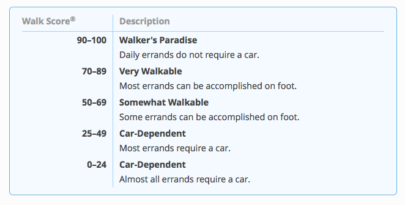

## Single Family Neighborhood Analysis

Summarize parcel data into the following groupings: 

Group 1

- Number of single-family zoned parcels within TPAs, by jurisdiction.
- Number of these parcels that have 2, 3 or 4 units. 
     
Group 2

- Number of single family zoned parcels in "walkable communities," by jurisdiction. For e.g., flat parts of Berkeley are arguably "walkable."
- Number of these parcels that have 2, 3 or 4 units. I don't know if this data is available.
     
Group 3

- Number of single-family zoned parcels within PDAs, by jurisdiction.
- Number of these parcels that have 2, 3 or 4 units. I don't know if this data is available.
- Overlap between Groups 1 and 2, and Groups 2 and 3. By jurisdiction.

### Project Management 

- [Asana Task](https://app.asana.com/0/229355710745434/699189363723461)
- [Box directory](https://mtcdrive.box.com/s/4st7a83e15ep0jddxpdqqvf08cfprp23)

## Data Sources

Parcel and Zoning Data Provided by MTC Modeling Team. Parcel and zoning data are not publicly available at this time. Copies of the data used for the analysis are provided in an ESRI filegeodatabase on Box and can be accessed by agency staff only. For more information, contact 
**Michael Reilly: mreilly@bayareametro.gov** 

### Bay Area Urbansim 
- [Urbansim Github Repo](https://github.com/BayAreaMetro/bayarea_urbansim)
- [Urbansim zoning and housing unit data (CSV)](https://mtcdrive.box.com/s/9uga2wbtqf8g86irg3wdnfv01vdedlzo)
- [Urbansim Parcels features (FGDB)](https://mtcdrive.box.com/s/1eif1qkj74mela7evg6jgll9xh887r8d)

## Analysis Parameters

Walkable neighborhoods were considered any neighborhood with a walkscore of 70 or above. Walkscore categories are summarized in the table below. For more on walkscore methodology, visit the [Walk Score website](https://www.walkscore.com/methodology.shtml)

## Methodology applied to solve problem

The following python script was run within the ArcGIS Pro Analysis window. The script builds a surface from intersection level point features containing walkscore using the [inverse distance weighted (IDW) interpolation technique](pro.arcgis.com/en/pro-app/tool-reference/spatial-analyst/idw.htm
). The script then creates a table which summarizes mean walkscore by parcel using the zonal statistics Spatial Analyst tool. 

- [Spatial Processing Script (Python)](Code/Create_Regional_Walkscore_Surface.py)

Data Summarizes were performed in Microsoft SQL Server with the following script: 

- [Analysis Summary Script (SQL)](Code/Single_Family_Zoned_Parcel_Analysis.sql)

## Results

### Spatial Data 

- [Analysis Features (FGDB)](https://mtcdrive.box.com/s/argn2y2govv05r3y8fs2swznbg64dn70)

### Tabular Data 

Single-Family Zoned Parcels By:
- [PDA](Data/Single_Family_Parcels_Res_Units_PDAs.csv)
- [TPA](Data/Single_Family_Parcels_Res_Units_TPAs.csv)
- [Walkscore >= 70](Data/Single_Family_Parcels_Res_Units_Walkable_Neighborhoods.csv)
- [PDA and Walkscore >= 70](Data/Single_Family_Parcels_Res_Units_Walkable_Neighborhoods_PDAs.csv)
- [TPA and Walkscore >= 70](Data/Single_Family_Parcels_Res_Units_Walkable_Neighborhoods_TPAs.csv)

- [Single Family Neighborhood Analysis Results (xls)](https://mtcdrive.box.com/s/j9pomjw9vb6wkfscho21ssemgezc3m2y)

### Cartographic Products 
