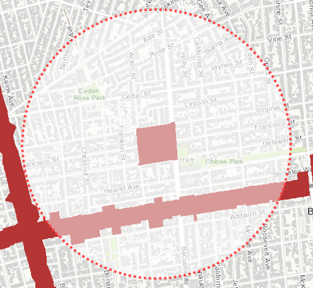
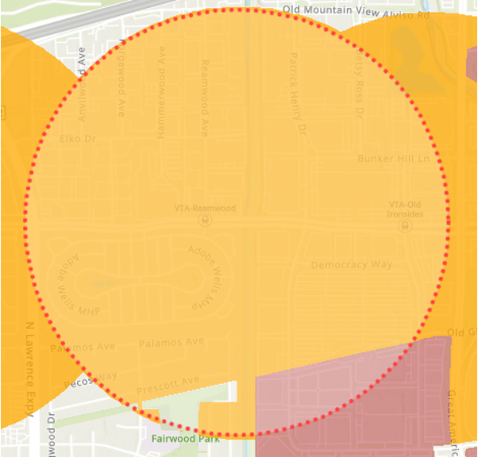

**Draft Status: Draft**

# Transit Oriented Communities

The Transit Oriented Communities (TOC) policy aims to increase residential and commercial densities in transit-rich areas, prioritizing affordable housing and commercial development in areas near regional transit hubs served by multiple transit providers. The goal of this analysis is to assess the baseline zoning for residential and office/commercial within Priority Development Areas (PDAs) and Transit Rich Areas (TRAs) within 1/2 mile of existing or planned fixed-guideway transit facilities. 

## Project Management 

- [Asana Task (MTC Only)](https://app.asana.com/0/304776046055605/1202042875475784/f)
- [Box Link (MTC Only)](https://mtcdrive.box.com/s/z4gzf4maxwrl25a6pelu0bjzlb8mc5a4)

## Table of Contents

## Analysis Parameters

### Transit Oriented Communities Policy Area

The proposed TOC policy will apply in the follow areas:

- PDAs or TRAs within the half-mile station/stop/terminal area of existing or planned **fixed-guideway transit**. 
- Fixed-guideway transit:
    - Regional rail: BART, Caltrain
    - Light Rail Transit: Muni Metro, VTA
    - Bus Rapid Transit: AC Transit (1T) Tempo, Van Ness BRT
    - Commuter rail: Capitol Corridor, ACE, SMART
    - Ferry terminals (limited to certain requirements only)

#### Where will the TOC Policy Apply?
The entirety or portion of a designated PDA that is within the half-mile station, stop, or terminal area. The TRA if no PDA has been designated. 

**North Berkeley BART**

North Berkeley BART: Applies to the portion of PDA within ½ mile radius

**VTA Reamwood**

VTA Reamwood: Applies to the entire TRA within ½ mile radius

## Methodology

## Expected Outcomes

## Results