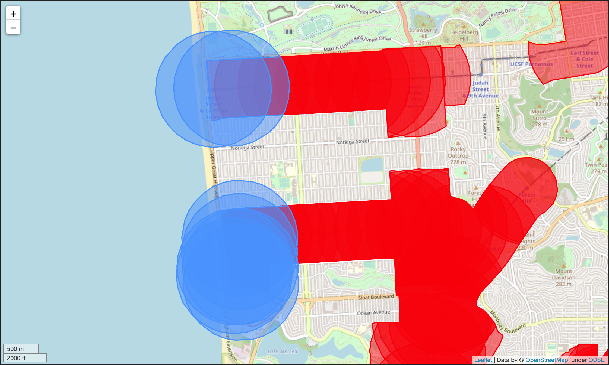
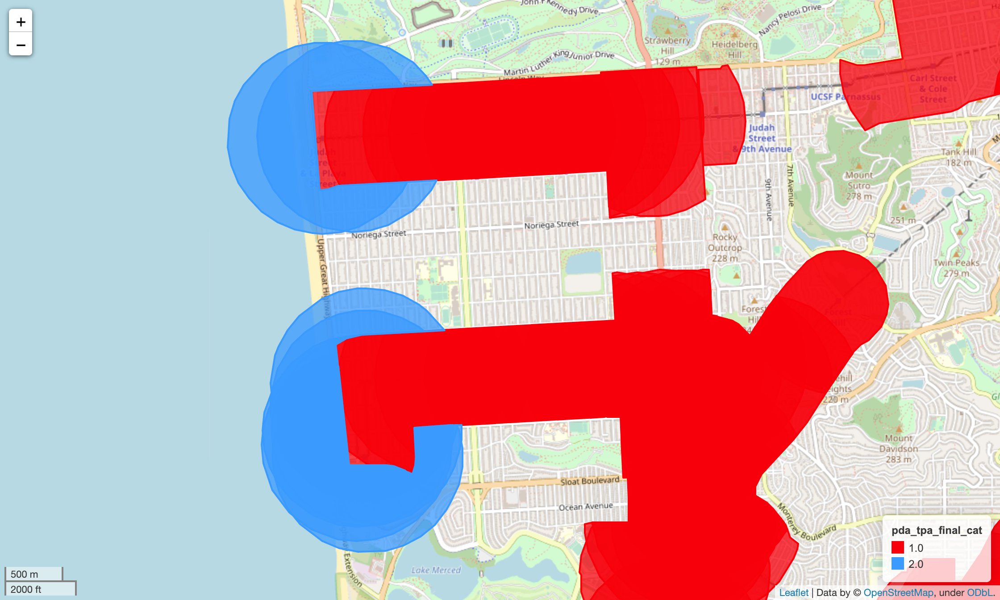

**Draft Status: Draft**

# Transit Oriented Communities

The Transit Oriented Communities (TOC) policy aims to increase residential and commercial densities in transit-rich areas, prioritizing affordable housing and commercial development in areas near regional transit hubs served by multiple transit providers. The goal of this analysis is to assess the baseline zoning for residential and office/commercial within Priority Development Areas (PDAs) and Transit Rich Areas (TRAs) within 1/2 mile of existing or planned fixed-guideway transit facilities. 

## Project Management 

- [Asana Task (MTC Only)](https://app.asana.com/0/304776046055605/1202042875475784/f)
- [Box Link (MTC Only)](https://mtcdrive.box.com/s/z4gzf4maxwrl25a6pelu0bjzlb8mc5a4)

## Table of Contents

- [Analysis Parameters](#analysis-parameters)
    - [Transit Oriented Communities Policy Area](#transit-oriented-communities-policy-area)
        - [Where will the TOC policy apply?](#where-will-the-toc-policy-apply)
        - [Where will the TOC policy not apply?](#where-will-the-toc-policy-not-apply)
        - [How will densities for new residential and commercial development be determined?](#how-will-densities-for-new-residential-and-commercial-development-be-determined)
- [Methodology](#methodology)
    - [Create Transit Oriented Communities Policy Area](#create-transit-oriented-communities-policy-area)
    - [Transit Oriented Communities Parcel/Land Use Overlay (Not completed)](#transit-oriented-communities-parcelland-use-overlay)

## Analysis Parameters

### Transit Oriented Communities Policy Area

The proposed TOC policy will apply in the follow areas:

- PDAs or TRAs within the half-mile station/stop/terminal area of existing or planned **fixed-guideway transit**. 
- Fixed-guideway transit:
    - Regional rail: BART, Caltrain
    - Light Rail Transit: Muni Metro, VTA
    - Bus Rapid Transit: AC Transit (1T) Tempo, Van Ness BRT
    - Commuter rail: Capitol Corridor, ACE, SMART
    - Ferry terminals (limited to certain requirements only)

#### Where will the TOC policy apply?
The entirety or portion of a designated PDA that is within the half-mile station, stop, or terminal area. The TRA if no PDA has been designated. 

**North Berkeley BART**

North Berkeley BART: Applies to the portion of PDA within ½ mile radius

**VTA Reamwood**

VTA Reamwood: Applies to the entire TRA within ½ mile radius

#### Where will the TOC policy not apply?

The TOC policy will not apply around airport air tram stations, including stations at San Francisco International Airport and at Oakland International Airport. Additionally, the policy **only** applies to areas within 1/2 mile of existing or planned fixed guideway transit service (regional rail, light rail, commuter rail, ferry, and bus rapid transit). In the case of planned service, only projects that are deemed likely to be delivered within the near-term (roughly 5 years) should be considered. As such, stops or stations associated with the following projects were excluded from analysis. Additionally, given its limited capacity, stations served only by Tideline Ferry service were also excluded from analysis.

| Project Name | Pba50_ID | agency_id | stop_id |
|---|---|---|---|
| Hovercraft pilot (not included in shapefile so OK) |  |   |
| Small-scale ferry | CC-021 |   |
| Tideline ferry |  | TD |
| SF historic streetcar extension | SF-024 |   |
| ReX blue | MU-060 |   |
| ReX green | MU-061 |   |
| ReX red | MU-062 |   |
| 23rd St BRT | CC-015 |   |
| Geneva-Harney BRT | SF-012 |   |
| Geary Phase 1 (not tagged in shapefile as BRT so OK) |   |   |
| Geary Phase 2 | SF-011 |   |
| El Camino San Mateo | SM-011 |   |
| El Camino Santa Clara (not tagged in shapefile as BRT so OK) |   |   |
| Telegraph | MU-033 |   |
| Appezzato Way | AL-016 |   |
| BRT to Brentwood | CC-018 |   |
| | |SI| SI:GA   |
| | |SI| SI:GG |
| | |SI| SI:HOT |
| | |SI| SI:ITA |
| | |SI| SI:ITG |
| | |SI| SI:RCC |
| | |SI| SI:T1 |
| | |SI| SI:T2 |
| | |SI| SI:T3 |
| | |SI| SI:WFR |
| | |BA| OAKL |

#### How will densities for new residential and commercial development be determined? 

Residential and commercial minimum and maximum densities will be determined by level of transit service. 

**Residential Densities**
| Level of Transit Service | Required Min Density | Allowable Density |
|---|---|---|
| Tier 1: Rail station served by 3 BART lines or a BART line and Caltrain Baby Bullet  | 100 units/net acre | 150 units/net acre |
| Tier 2: Stop/station served by 2 BART lines or Caltrain Baby Bullet | 75 units/net acre | 100 units/net acre |
| Tier 3: Stop/station served by 1 BART line, Caltrain, light rail transit, or bus rapid transit | 50 units/net acre | 75 units/net acre |
| Tier 4: Commuter rail (SMART, ACE, Capitol Corridor) or ferry terminal (only if PDA at ferry terminal) | 25 units/net acre | 35 units/net acre |

**Commercial Densities**
| Level of Transit Service | Required Min Density | Allowable Density |
|---|---|---|
| Tier 1: Rail station served by 3 BART lines or a BART line and Caltrain Baby Bullet  | 4 Floor Area Ratio (FAR) | 8 FAR |
| Tier 2: Stop/station served by 2 BART lines or Caltrain Baby Bullet | 3 FAR | 6 FAR |
| Tier 3: Stop/station served by 1 BART line, Caltrain, light rail transit, or bus rapid transit | 2 FAR | 4 FAR |
| Tier 4: Commuter rail (SMART, ACE, Capitol Corridor) or ferry terminal (only if PDA at ferry terminal) | 1 FAR | 3 FAR |

## Methodology

### Create Transit Oriented Communities Policy Area

Notebook: [Create Transit Oriented Communities Policy Area](Create_Transit_Oriented_Communities_Policy_Area.ipynb)

Inputs:
- [PBA2050 Priority Development Areas](https://arcgis.ad.mtc.ca.gov/portal/home/item.html?id=85043289ac774a928e4628aa904a317c#overview)
- [Transit Stops - Existing and Planned](https://arcgis.ad.mtc.ca.gov/portal/home/item.html?id=a4e761b25425464e978829db4c3563dc)

Outputs:
- [Station Areas (MTC Access Only)](https://mtcdrive.box.com/s/53q5607zn9rb5bnd1eepjlmcebhqebjd)
- [Stations Level of Service (MTC Access Only)](https://mtcdrive.box.com/s/gpk8vqzq2aa1w6r9g4sfqtocbifihorn)
- [Stations Level of Service De-duplicated (MTC Access Only)](https://mtcdrive.box.com/s/3ux5fsq5osu2wyrrnw0q9n7clgb492gc)
- [Transit Oriented Communities Policy Area (MTC Access Only)](https://mtcdrive.box.com/s/0ngbewx00g9m4uhwrgbx1cyr6m14jsth)

1. Preprocessing
    - Pull all input datasets and convert to geodataframe; project to `EPSG:26910`
2. Create dataframe of fixed-guideway stops
    - Fixed-guideway stops: `['Rail', 'BRT', 'Tram, Streetcar, Light Rail', 'Cable Tram','Ferry']`
    - Remove other stops where policy does not apply
    - Drop duplicate route/stop combinations
        - A number of stops are served by routes with the same route id for both directions. These need to be dropped to accurately count the number of unique routes that pass through any given station in later steps. 
3. Create stop station areas
    - Find stops that are nearby:
        - Tram, Streetcar, Light Rail, and BRT within 75 ft (22.86 meters) of other stops are considered same stop
        - Rail, Ferry within 300 ft (91.44 meters) of other stops are considered same stop
    - Dissolve stop areas to create station areas; this creates a multi-part geometry. 
    - Explode multi-part station areas to single-part station areas
    - Create station area id
    - Assign station id to stops
4. Drop duplicate routes from stations
    - After stations were identified in the previous step, some stations had duplicate route ids. These need to be dropped to accurately count the number of unique routes that pass through any given station in later steps. 
5. Count BART and Caltrain routes by station
    - Add BART and Caltrain route ids to planned routes
    - Group transit routes by station and agency
    - Add count columns to station geodataframe w/ point geometry
6. Flag levels of transit service and rank stations
    - **Level of Transit Service**
        - Tier 1: Rail station served by 3 BART lines or a BART line and Caltrain Baby Bullet
        - Tier 2: Stop/station served by 2 BART lines or Caltrain Baby Bullet
        - Tier 3: Stop/station served by 1 BART line, Caltrain, light rail transit, or bus rapid transit
        - Tier 4: Commuter rail (SMART, ACE, Capitol Corridor) or ferry terminal (only if PDA at ferry terminal)
    - **Station rank:** Rank rail routes from 1-4 with 1 being the highest rank. This will be used along with tier to sort and drop duplicate routes, preserving stations with highest Level of Service and Route Rank. 
        - `Rail, Ferry`: 1
        - `Tram, Streetcar, Light Rail`: 2
        - `BRT`: 3
        - `Cable Tram`: 4
7. Create Transit-Rich Station Areas
    - Create 1/2 mile buffer (804.672 meter) around stations (point geometry)
8. Determine TOC Policy Applicability Area
    - Applicable areas include:
        - PDAs areas within 1/2 mile of fixed-guideway stations
        - Areas outside of PDAs within 1/2 mile of fixed-guideway station
    - Flag areas where pda area within toc area is greater than 50% of total pda area
        - Within areas where this is true **all** pda areas apply
    - Flag areas where sum of all pda areas within toc area is greater than 50% of total toc area
        - Within areas where this is true **all** pda areas apply
    - Flag areas where toc area greater than 50% 
        - Within areas where this is true **all** toc area applies 
    - Flag final pda or tpa area
9. Remove designated pda areas from toc designated areas

In many cases, an area designated as a toc may overlap with an area designated as a pda area. This results because, in many cases, it can be true that a pda may be 50% within a toc area, and a neighboring toc may overlay the same pda by more than 50%. In these cases, the intersecting area should be removed with priority given to pda areas.

**TOC area overlaps designated PDA**

**TOC overlap area removed**

### Transit Oriented Communities Parcel/Land Use Overlay
The work documented below was exploratory work that was carried out but ultimately was not used. This work may be picked back up at a later date and the documentation here will serve as a scaffolding to restart work at a future date.

Notebook: [Transit Oriented Communities Parcel Overlay](Transit_Oriented_Communities_Parcel_Overlay.ipynb)

Inputs:
- [Transit Oriented Communities Policy Area (MTC Access Only)](https://mtcdrive.box.com/s/0ngbewx00g9m4uhwrgbx1cyr6m14jsth)
- [Parcel Atlas Parcel Geo-Lookup v2 (MTC Access Only)](https://data.bayareametro.gov/resource/5y7p-4hs4)
- **Redshift Tables via query**
    - basis_staging.parcel_base_tbl
    - basis_staging.zn_base_tbl
    - basis_staging.zn_base_lot_properties
    - basis_staging.gp_base_tbl
    - basis_staging.gp_base_density

Outputs:
- [TOC Land Use Summaries Tableau Dashboard (MTC Access Only)](https://10ay.online.tableau.com/t/metropolitantransportationcommission/views/TransitOrientedCommunitiesLandUseSummaries/ResidentialandCommercialCapacitybyJurisdiction?:showAppBanner=false&:origin=viz_share_link&:display_count=n&:showVizHome=n)
- [TOC Residential and Commercial Capacities CSV (MTC Access Only)](https://mtcdrive.box.com/s/6tv583axa8jmgrzcsiuyio7phs09zbi9)
- [TOC Residential and Commercial Capacities GeoJSON (MTC Access Only)](https://mtcdrive.box.com/s/htzptkiwws90qxnxjwyysgay4ap967wh)

1. Perform point in polygon overlay
    - Calculate parcel geometry centroids 'on the surface' of the parcel
    - Spatially join parcel centroids w/ PDAs and remainder TRAs
    - Flag PDA and remainder TRA areas
    - Create area name column that indicates PDA name and remainder TRA stop area names
2. Merge parcels w/ PDA TRA flags w/ plan land use attributes
~~3. Calculate DUA and FAR density based on zoning or general plan designation~~
    ~~- Calculate parcel area (acres / square feet)~~
    ~~- Set source for residential and commercial capacities `('Zoning', 'General Plan', 'Missing Capacity')`~~
    ~~- Calculate residential capacity based on source (DUA * acres)~~
    ~~- Calculate commercial capacity based on source (FAR * sqft)~~
4. Determine where there is missing data
    - Determine where there is missing residential capacity. Regional zoning designations that allow **residential uses**: `('Specific or Special Plan Areas', 'Single Family Residential', 'Multi-Family Residential', 'Mixed Use Residential', 'Mixed Use Commercial')`
    - Determine where there is missing commercial capacity. Regional zoning designations that allow **commercial uses**: `('Specific or Special Plan Areas', 'Mixed Use Residential','Commercial', 'Mixed Use Commercial')` 
5. Export data for review
    - Export select columns as CSV and GeoJSON
6. Create TOC land use summaries Tableau workbook
    - [Tableau Workbook (MTC Access Only)](https://mtcdrive.box.com/s/pse3mlwq3y194vkjlspgep9gjkqcfisy)~~